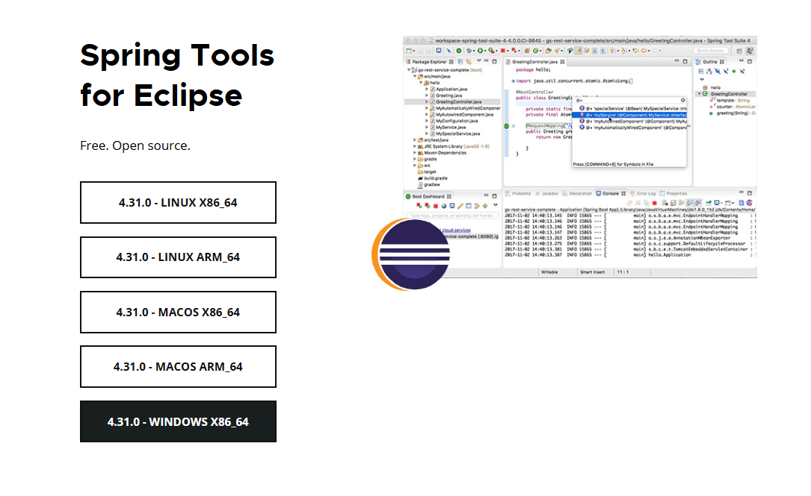
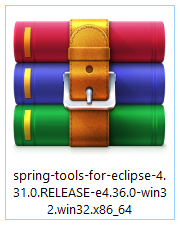
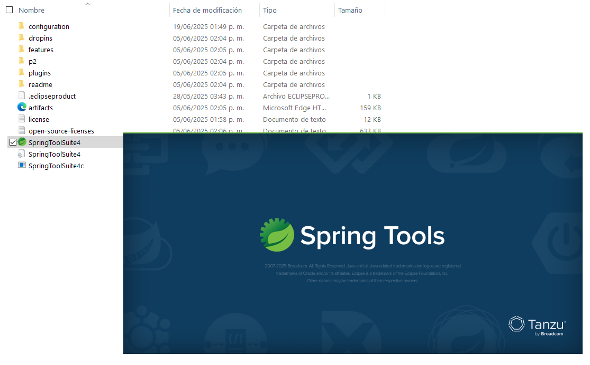
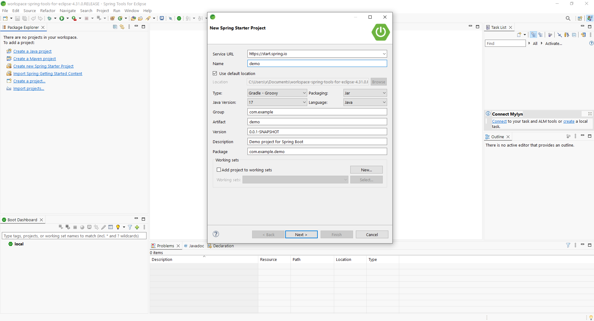
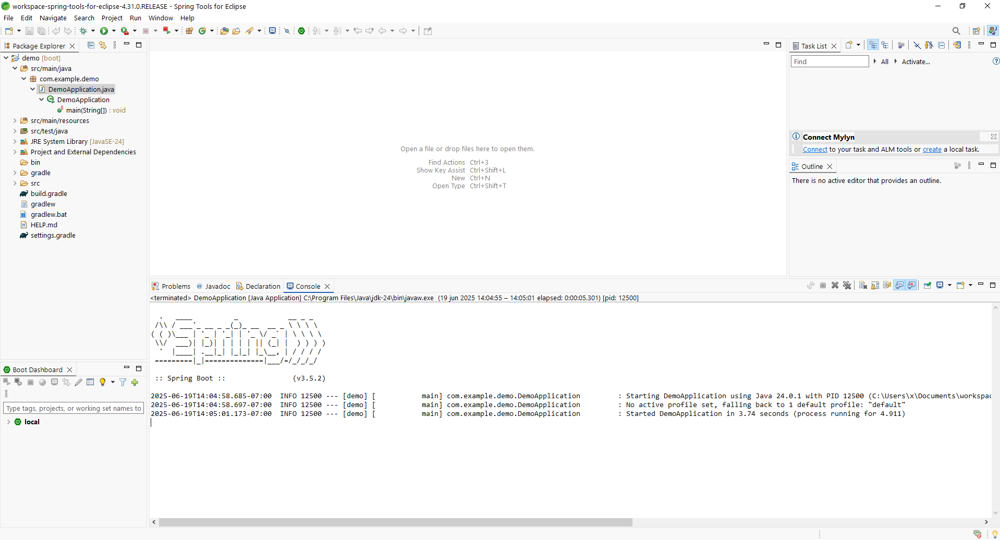

# Installing Eclipse STS (Spring Tool Suite)

Eclipse STS (Spring Tool Suite) is an IDE tailored for Spring developers. It's based on Eclipse but comes pre-configured with tools and plugins for easier Spring Boot development.

## Step 1: Download Eclipse STS

Visit the official Spring website to download the installer:

- 🌐 **STS Downloads:** [https://spring.io/tools](https://spring.io/tools)

Choose the version for your operating system (Windows, macOS, Linux).

> ⚠️ Make sure you have a JDK (Java Development Kit) installed and configured before running Eclipse STS. Preferably Java 17 or 21.

## Step 2: Extract and Launch STS

1. Once downloaded, unzip the file to a convenient location, for example:

2. Open the folder and launch:

- `SpringToolSuite4.exe` (Windows)
- `SpringToolSuite4.app` (macOS)
- `SpringToolSuite4` executable (Linux)

## Step 3: Configure JDK (If needed)

If STS doesn't detect your JDK:

1. Go to `Window > Preferences > Java > Installed JREs`.
2. Click **Add > Standard VM**.
3. Locate your JDK folder (e.g., `C:\Program Files\Java\jdk-21`) and click **Finish**.
4. Select it as the default and click **Apply and Close**.

## Step 4: Create a New Spring Boot Project

1. Click on **File > New > Spring Starter Project**.
2. Enter the project name and base package (e.g., `com.example.demo`).
3. Choose:

- Java version (17 or 21).
- Project type: Maven (recommended).
- Dependencies: Spring Web, Spring Data JPA, PostgreSQL, etc.

4. Click **Finish**.

STS will generate a complete Spring Boot project ready to run and develop.

## Step 5: Run Your Project

Once the project is created:

- Locate the main class (annotated with `@SpringBootApplication`).
- Right-click on it and select **Run As > Spring Boot App**.

> ✅ If everything is configured correctly, the embedded server (like Tomcat) will start, and your app will run locally.

---

## Optional Tips

- 💡 **Install Lombok Plugin**: Go to `Help > Eclipse Marketplace`, search for **Lombok**, and install it.
- 🛠️ **Dark Theme**: Preferences > General > Appearance > Theme > Choose "Dark".
- 📦 **Install More Plugins**: Use the Eclipse Marketplace to add support for Git, Docker, etc.
