# Recommended VS Code Extensions

Here is a list of essential Visual Studio Code extensions that will improve your development experience, especially when working with Angular and TypeScript.

---

## Angular 17 Snippets

Provides Angular v17 code snippets for components, directives, pipes, and more.

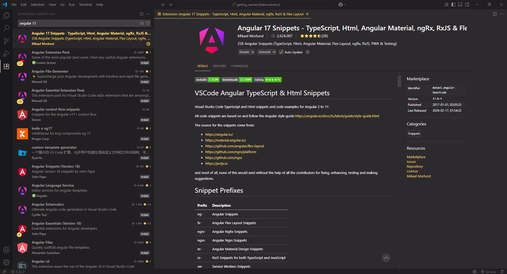

---

## Angular Language Service

Offers rich editing support for Angular templates including completions, error checking, and navigation.

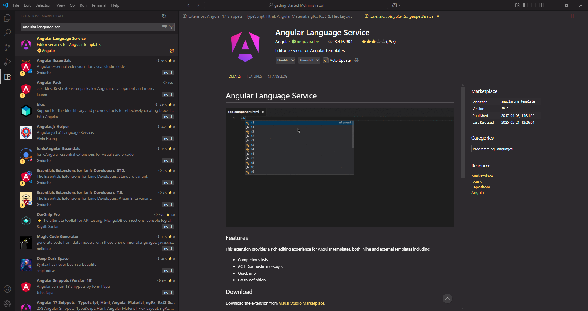

---

## Angular Schematics

Run Angular CLI schematics directly inside VS Code via context menu or commands.

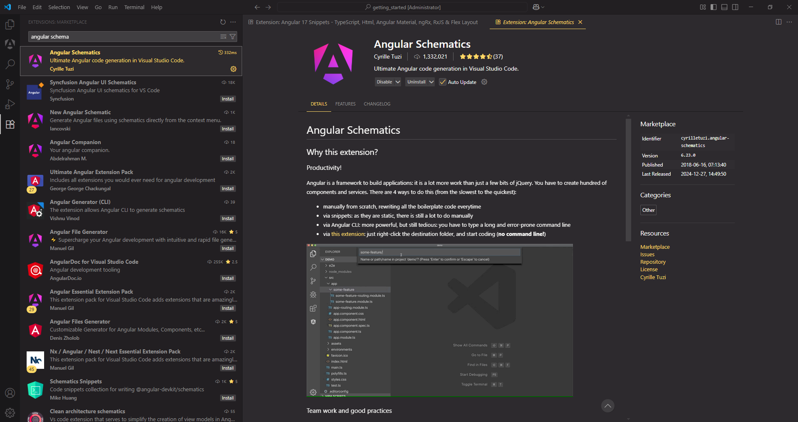

---

## Angular2-inline

Syntax highlighting and IntelliSense for inline Angular HTML and CSS in TypeScript files.

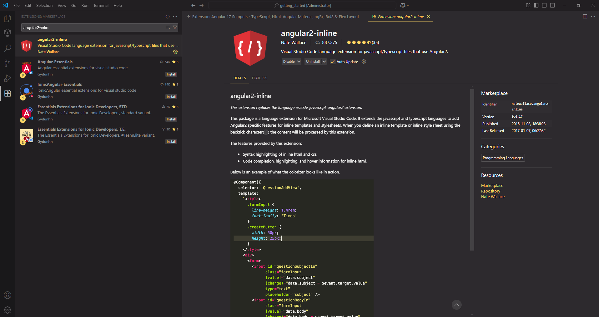

---

## Auto Close Tag

Automatically closes HTML and JSX tags. Great for Angular templates.

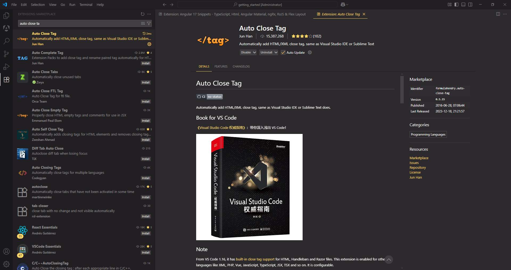

---

## Auto Import

Automatically finds, suggests, and adds imports for your JavaScript/TypeScript code.

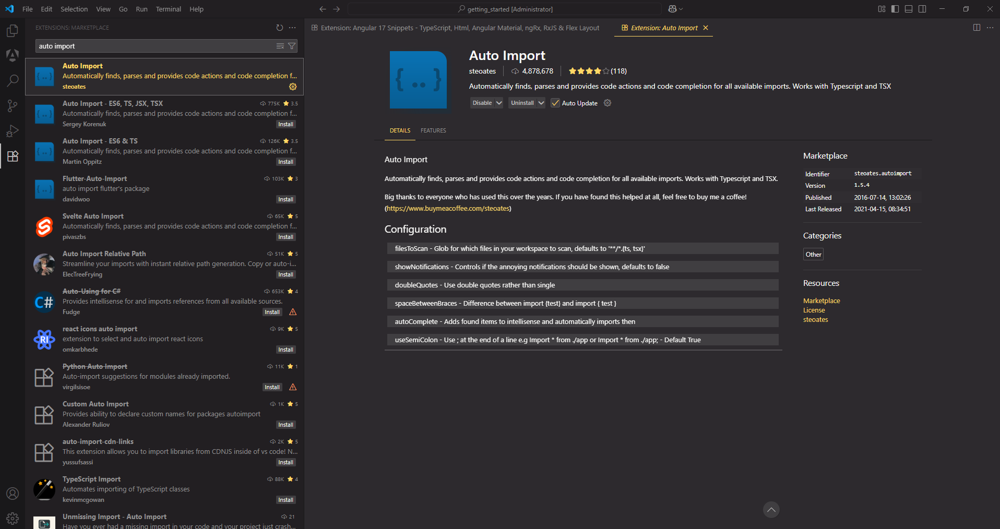

---

## Better Comments

Organize your code comments using color and styling for TODOs, warnings, and notes.

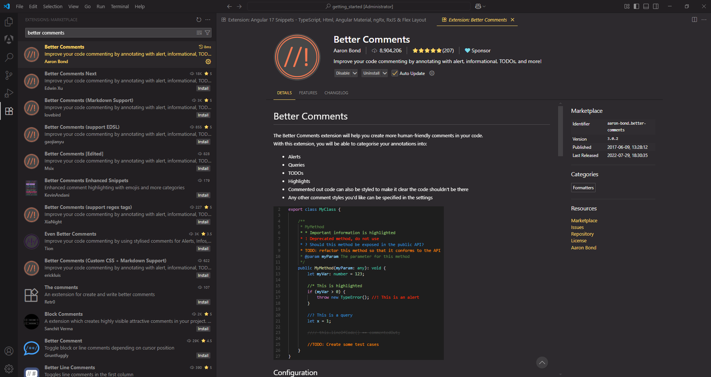

---

## Error Lens

Highlights errors and warnings inline with customizable colors and effects.

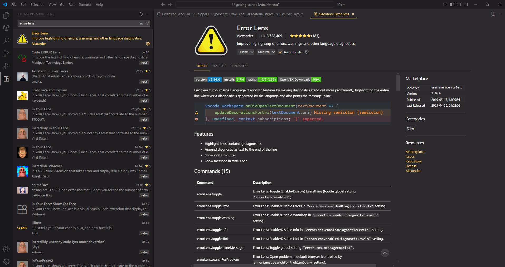

---

## ESLint

Integrates ESLint into VS Code, providing real-time linting and auto-fixing capabilities.

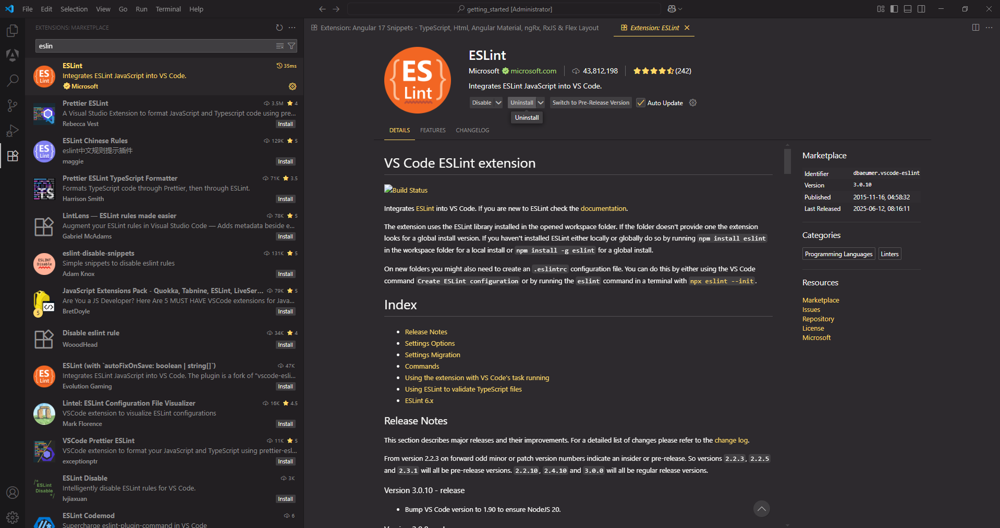

---

## GitHub Actions

Manage and view GitHub Actions workflows directly from your code editor.

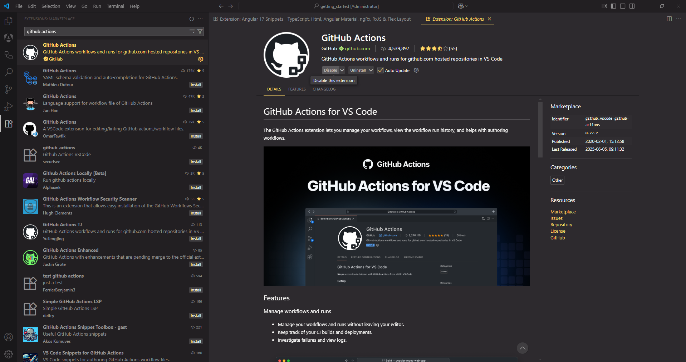

---

## Live Server

Launch a local development server with live reload support for static and dynamic pages.

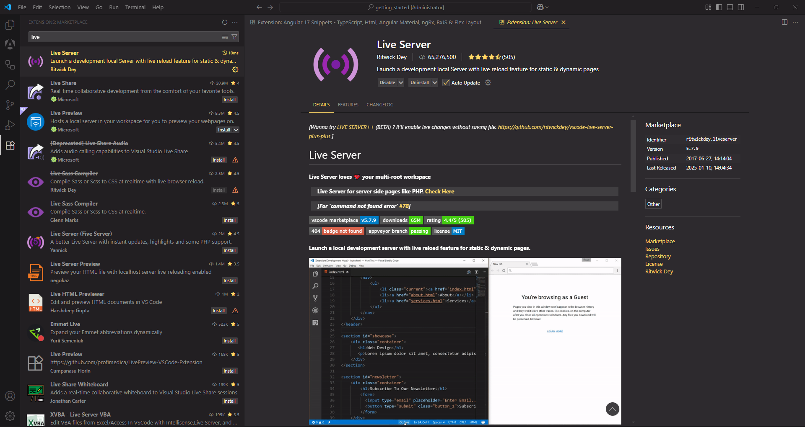

---

## Live Server Preview

Preview your website inside VS Code with side-by-side rendering, similar to a browser.

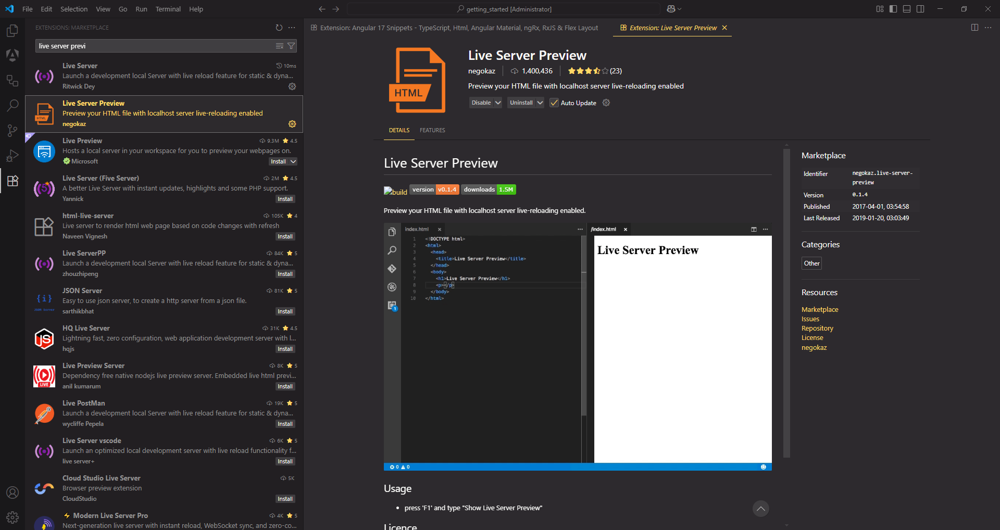

---

## One Monokai Theme

A vibrant, modern dark theme based on the classic Monokai.

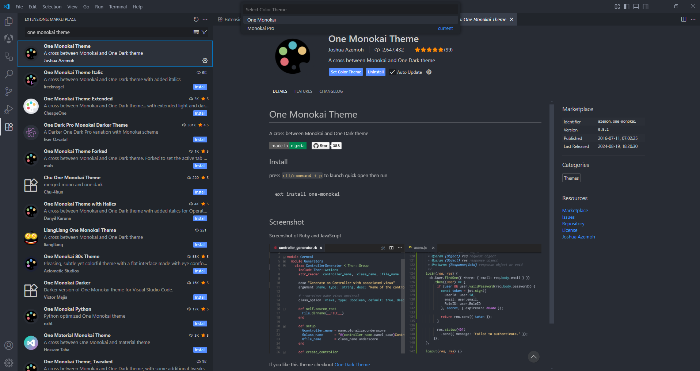

---

## Paste JSON as Code

Converts copied JSON into strongly typed classes and interfaces for TypeScript and more.

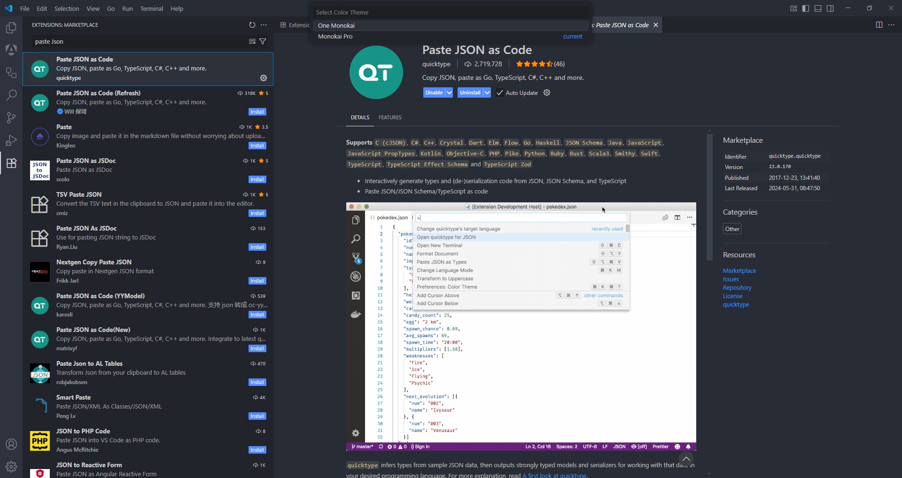

---

## PrimeFlex 3 Snippets

Provides quick code snippets for PrimeFlex 3 utility classes.

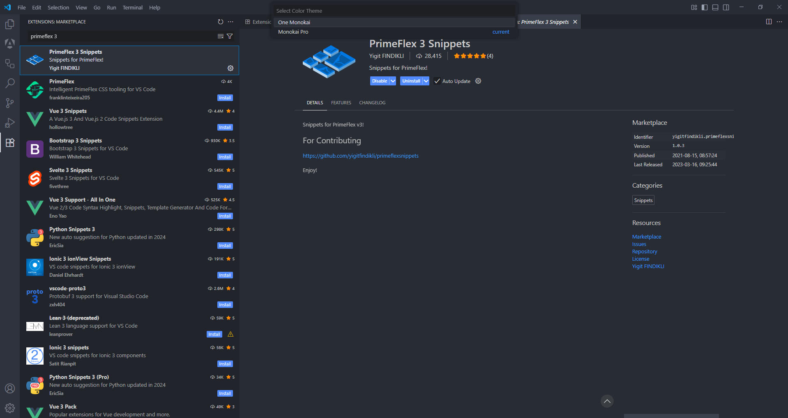

---

## TypeScript Importer

Automatically searches for and inserts missing TypeScript imports as you type.

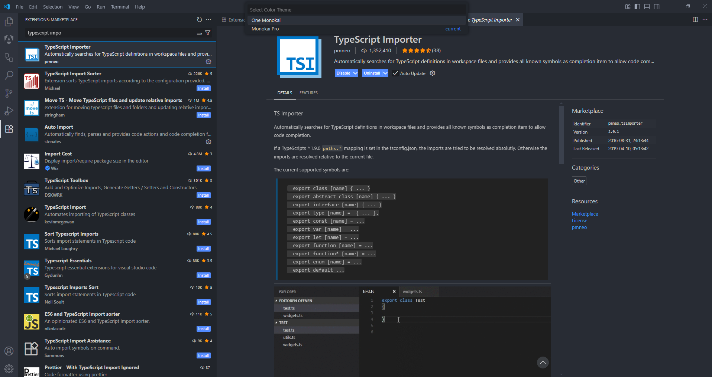

---

## Unused Imports

Detects and helps you remove unused imports in TypeScript files.

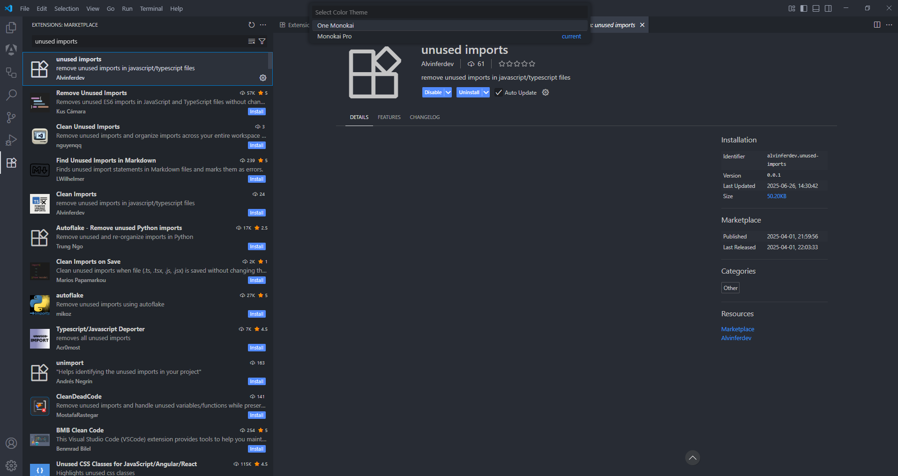
