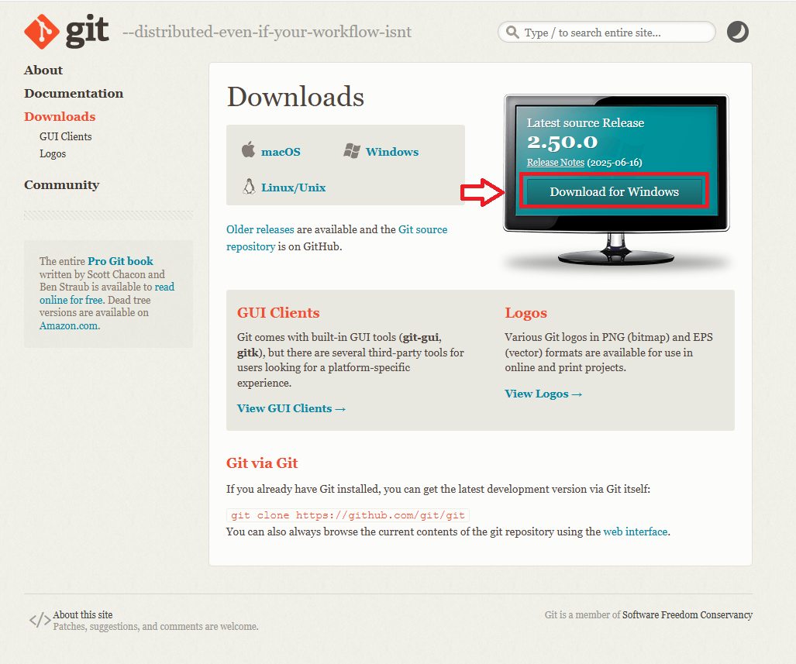
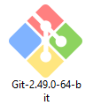
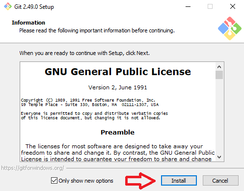
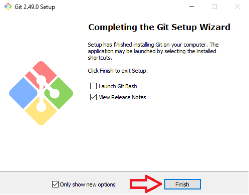
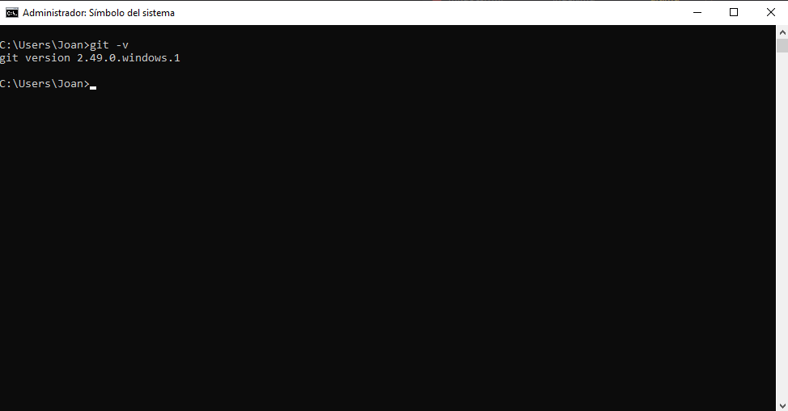

# Installing Git

To install Git on your system, go to the official website: [git-scm.com](https://git-scm.com/downloads), and follow the steps below.

## Step 1: Download Git

- Click on the **Download for Windows** button and wait for the download to complete.

  

## Step 2: Locate the Installer

- Once the download is finished, open your **Downloads** folder and locate the Git installer file.

  

## Step 3: Run the Installer

- Double-click the installer file to run it.
- In the **Information** window that appears, click on **Install** to begin the installation.

  

## Step 4: Complete the Installation

- Wait for the installation process to finish.
- Once completed, click on **Finish** to close the installer.

  

## Step 5: Verify the Installation

- To ensure that Git was installed correctly, open a **CMD** window and run the following command:

  ```
  git -v
  ```

  

## Step 6: Confirm Git is Working

- If the terminal displays a version number (e.g., `git version 2.49.0`), then Git has been successfully installed and is ready to use.
