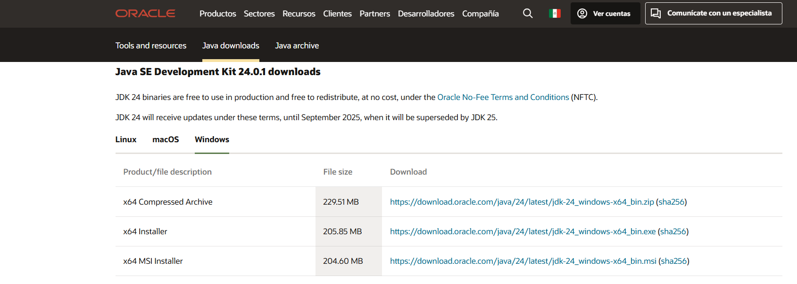
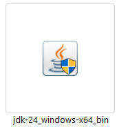
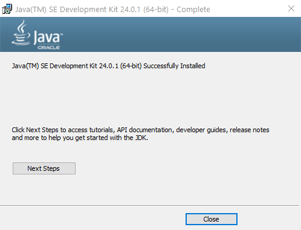
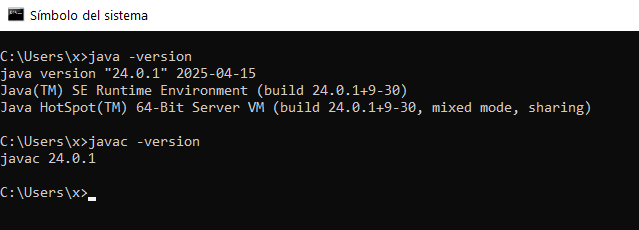

# Installing Java JDK

To run and develop Java applications, you need to install the Java Development Kit (JDK). The JDK includes the Java Runtime Environment (JRE), the Java compiler, and other development tools.

## Step 1: Download the JDK

Go to the official Oracle website or use a trusted open-source alternative like **Adoptium**.

- **Oracle JDK:** [https://www.oracle.com/mx/java/technologies/downloads/](https://www.oracle.com/mx/java/technologies/downloads/)

> We recommend using **Temurin** for general development due to its open license and stability.

## Step 2: Choose the Right Version

- For modern Java projects, Java 17/21 or Java 24 (LTS) is recommended.
- Choose your operating system: Windows, macOS, or Linux.
- Download the **installer** or the **zip archive**.



## Step 3: Install the JDK

### For Windows

- Run the installer and follow the setup instructions.



- During installation, allow it to **set the JAVA_HOME environment variable** if prompted.



- After installation, verify it was successful.



### For macOS/Linux

- Extract the `.tar.gz` or use package managers like:
  - **Homebrew (macOS):**
    ```bash
    brew install openjdk@21
    ```
  - **APT (Ubuntu):**
    ```bash
    sudo apt install openjdk-21-jdk
    ```

## Step 4: Configure Environment Variables

### On Windows

- Set `JAVA_HOME` to the JDK installation path (e.g., `C:\Program Files\Java\jdk-21`).
- Add `%JAVA_HOME%\bin` to your `Path` variable.

### On macOS/Linux

Edit your `~/.bashrc`, `~/.zshrc`, or `~/.profile`:

```bash
export JAVA_HOME=/path/to/your/jdk
export PATH=$JAVA_HOME/bin:$PATH
```
