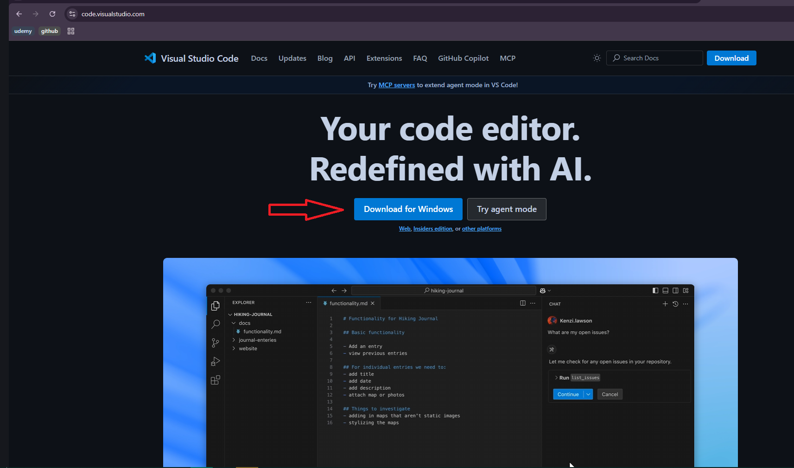
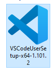
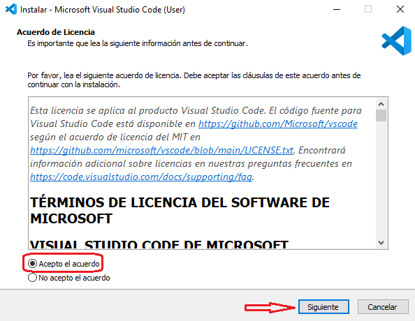
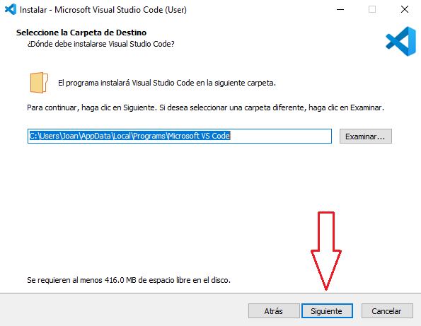
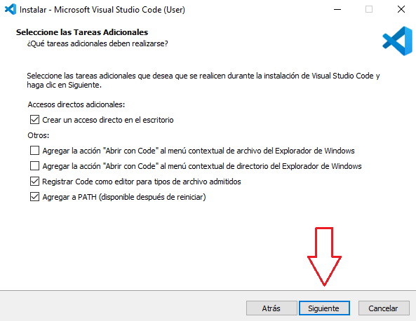
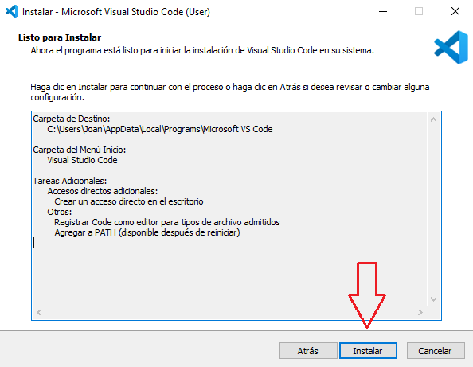
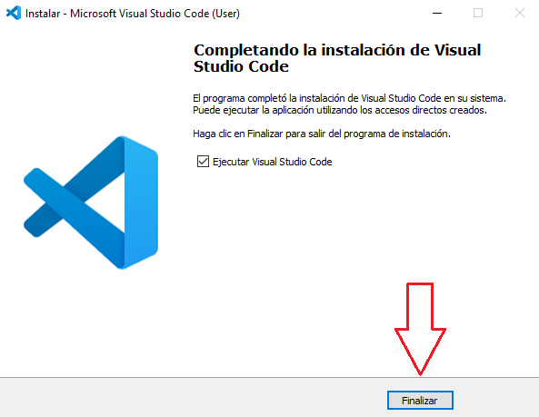
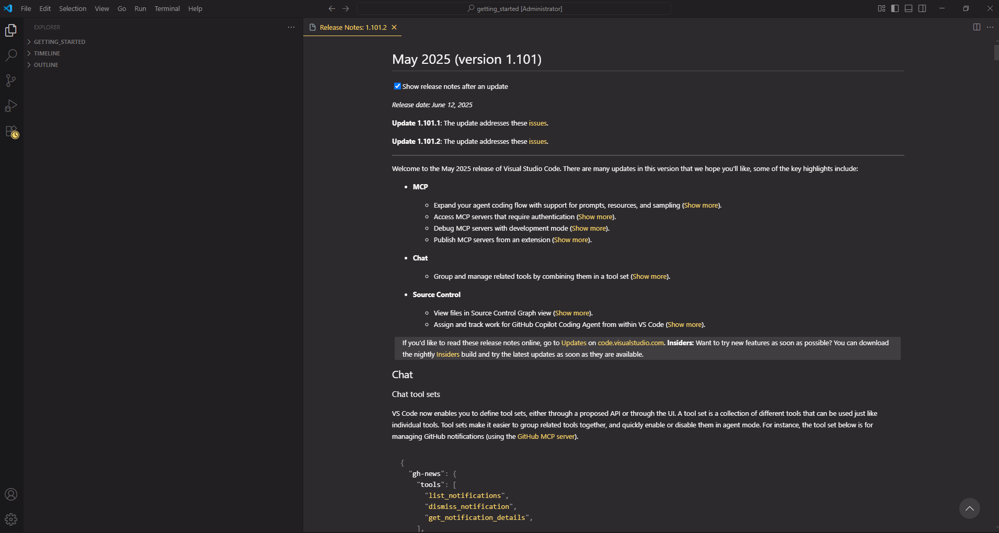

# Installing Visual Studio Code

**Visual Studio Code (VS Code)** is a free, lightweight, and powerful code editor for developers. Follow the steps below to install it on your computer.

---

## Step 1: Download VS Code

Go to the official download page:

👉 [https://code.visualstudio.com/Download](https://code.visualstudio.com/Download)

Choose the version for your operating system (e.g., Windows).

---

## Step 2: Run the Installer

Once the installer is downloaded, double-click it to begin the installation process.

---

## Step 3: Accept the License Agreement

- In the **License Agreement** window, select  
  **"I accept the agreement"**.
- Click **Next**.

---

## Step 4: Choose Installation Folder

- Select the destination folder where VS Code will be installed.
- Click **Next** to continue.

---

## Step 5: Select Additional Tasks

- Leave the default options or choose extra options like:
  - Add to PATH
  - Add "Open with Code" to context menu
- Click **Next**.

---

## Step 6: Ready to Install

- Review your setup in the "Ready to Install" window.
- Click **Install** to begin.

---

## Step 7: Finish Installation

- Once the installation is complete, click **Finish**.
- If the option **"Launch Visual Studio Code"** is checked, it will open automatically.

---

## ✅ Confirmation

If VS Code opens after installation, it means the setup was successful 🎉

